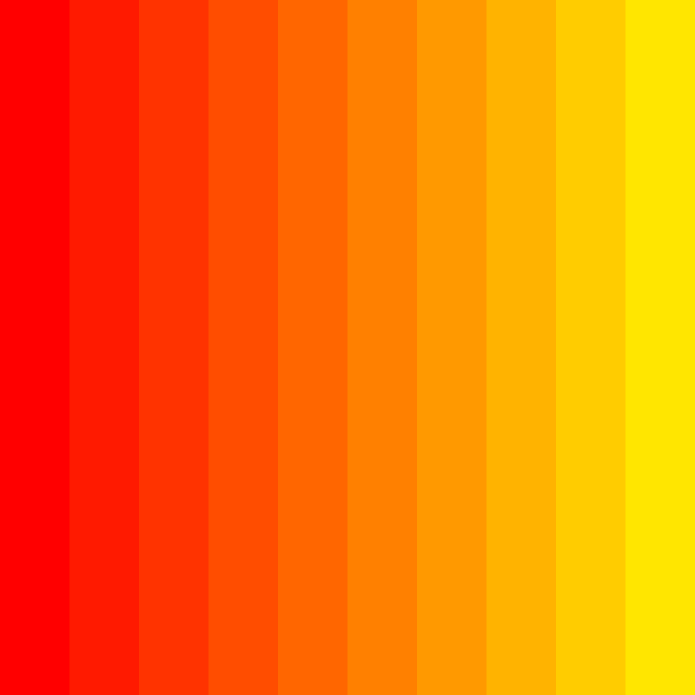
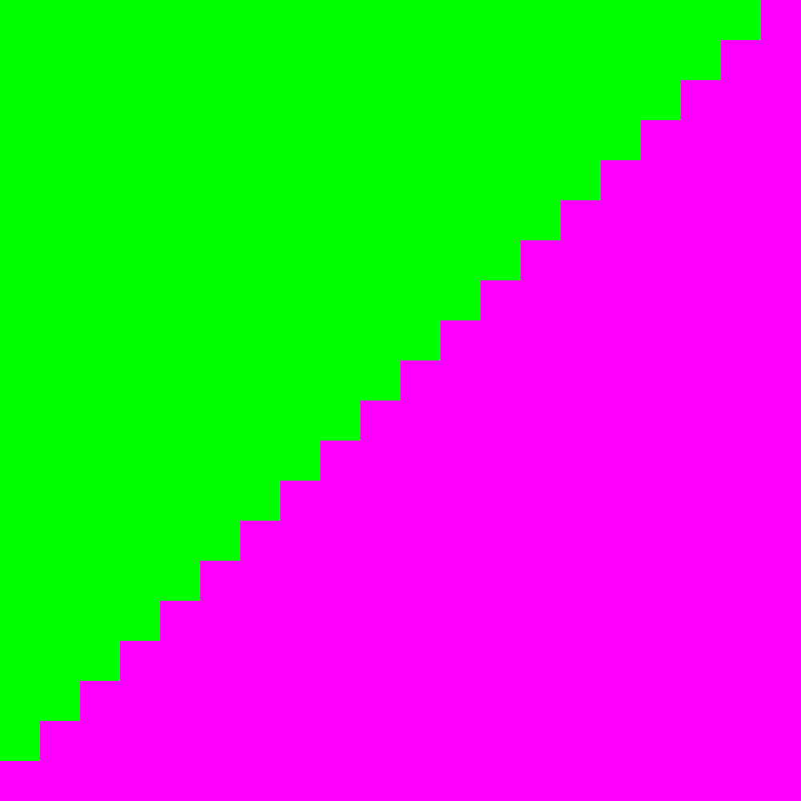
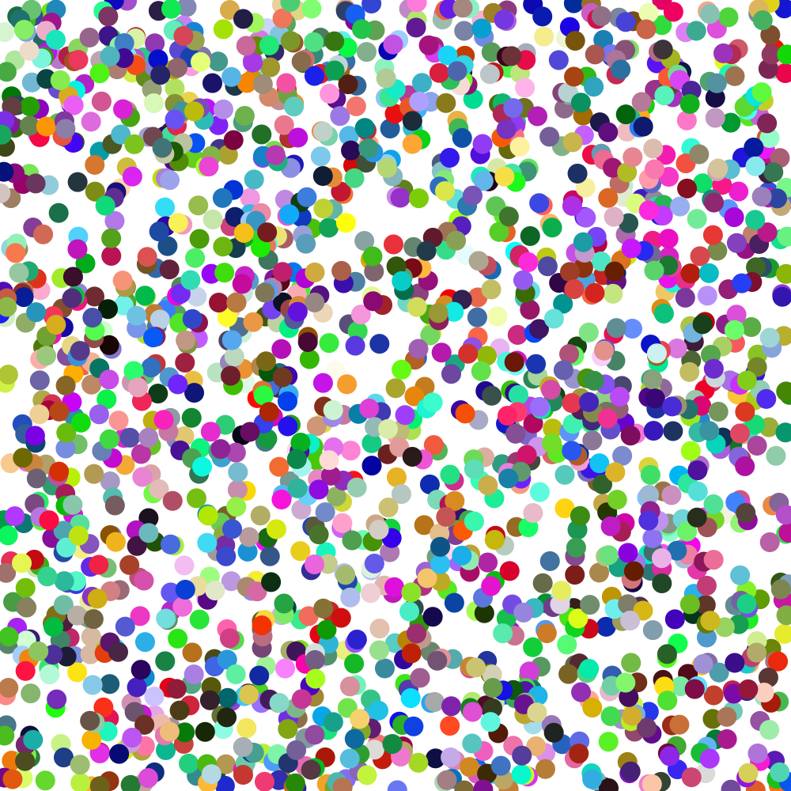

# Session 1 Challenges

Here are some challenges building on the things we started this week!

## Donut

Use `oval()` s to draw a donut that fills the canvas. Bonus points if you make the donut responsive to the canvas size. 🍩

## Stripes

Modify our stripes-drawing script to create a stripey-gradient of color by augmenting the red, green, or blue fill values rather than setting them randomly? 🌇

## Staircase

Loop over some rectangles to draw a staircase 🪜

## Confetti

Use random() along with width() and height() to draw shapes at random positions on the canvas 🎉

