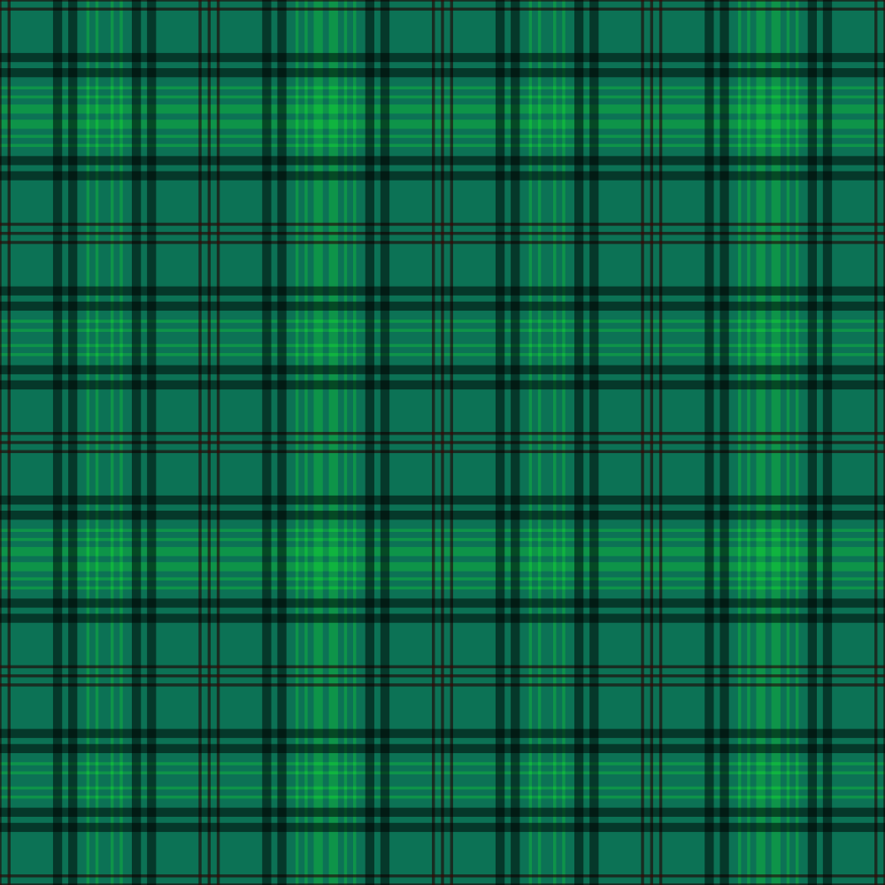
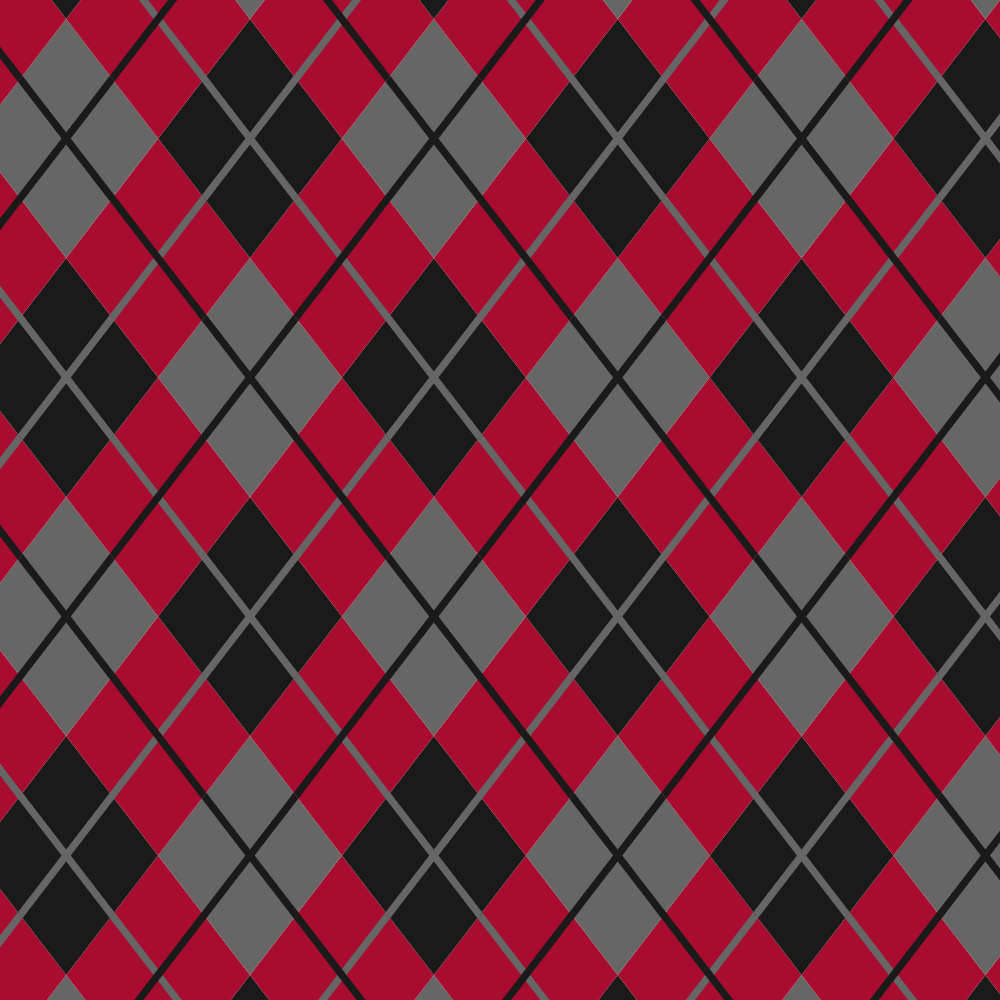
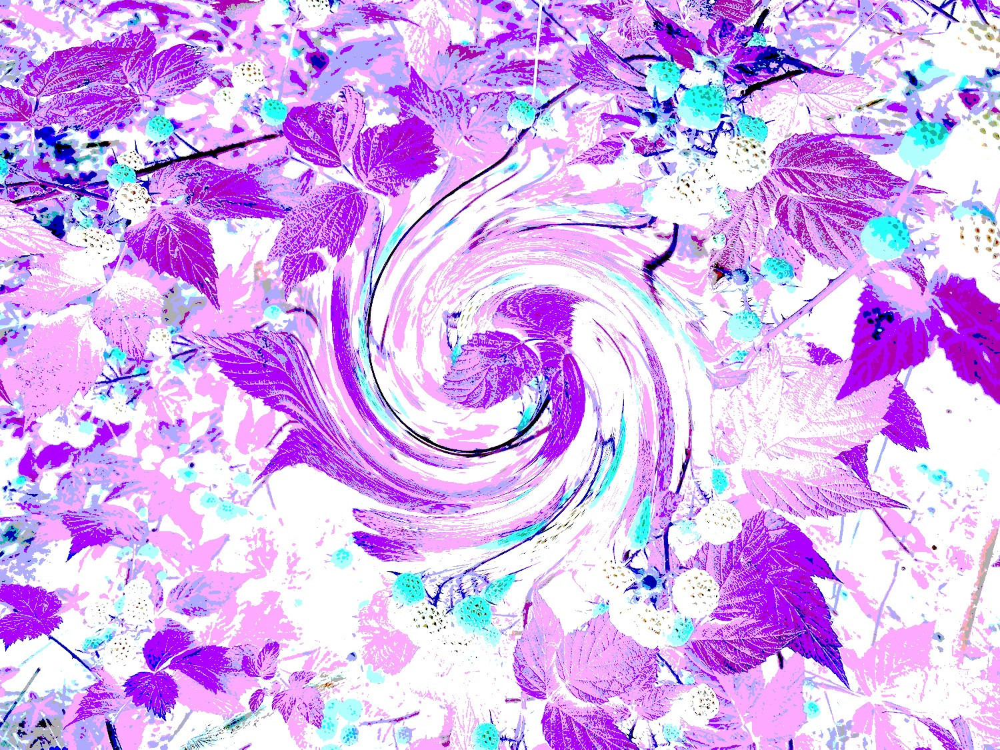
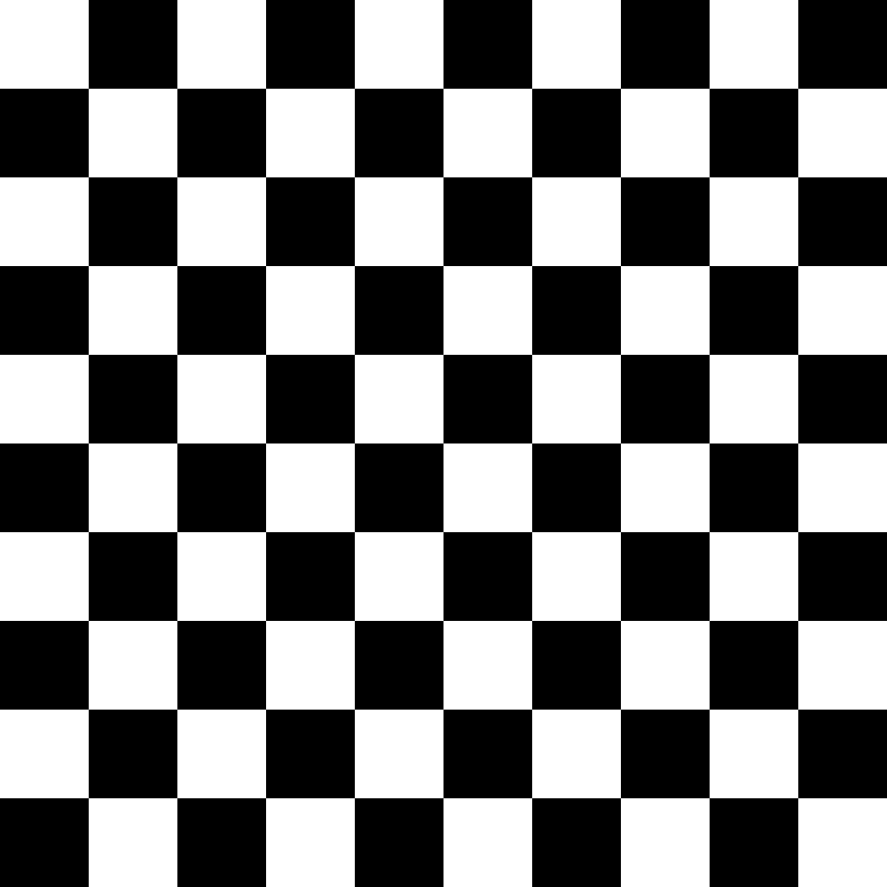
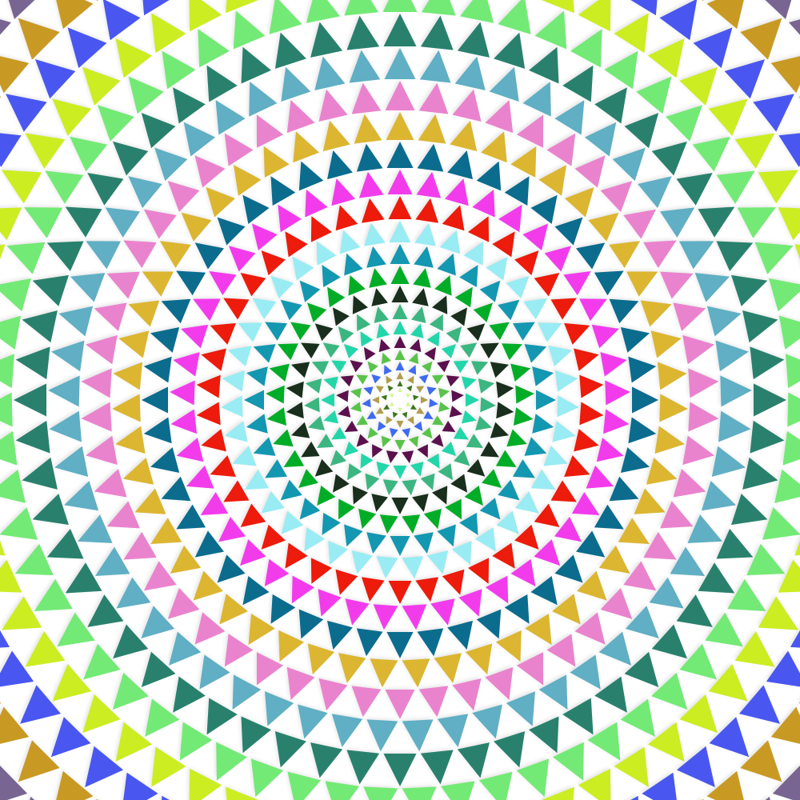

# Session 3 Challenges

Find a plaid/argyle/polka dot/whatever pattern in your sweater drawer, in your house, or online and try to execute it in DrawBot.

Try to find where the pattern repeats and use a loop for that so you don’t have to do more manual drawing than you have to. Bonus points for defining that repeating pattern as a function, and then make a grid that simply calls the function.





## Custom filter

Define a myCustomFilter() function that combines multiple `ImageObject()` filters, so that the following code works (or something like it).
```
myImage = ImageObject('image.jpg')  # make an image object from a file
myCustomFilter(myImage)             # pass the image object to our filter, which will modify it
newPage(*myImage.size())            # make a new page
image(myImage, (0, 0))              # draw the image
```



## Play with Filters

Have fun experimenting..[here’s a list of them!](https://www.drawbot.com/content/image/imageObject.html#imageobject)!


## Checkerboard

Use our grid-making technique to make a checkerboard. Bonus points if  you can make one using an if statement and also without using an if statement.



## Ring of Shapes

Make a custom polygon (such as a triangle), and then draw concentric rings of that polygon, giving each ring a different color. I might suggest abstracting this into a few different steps:
make a function to represent your shape
make a function to represent a ring of shapes
then draw your document and make a loop of shape rings

